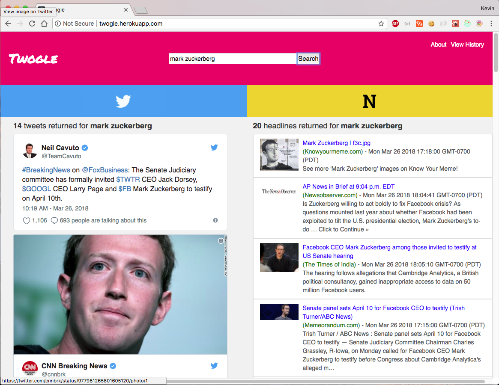

# Twogle

Twogle lets you search both NewsAPI and Twitter simultaneously-- allowing you to browse through the headlines and the buzz they generate on Twitter in one convenient scroll session.



It utilizes both [Twitter's Search API](https://developer.twitter.com/en/docs/tweets/search/api-reference/get-search-tweets.html) and [NewsAPI](https://newsapi.org/docs/endpoints/everything).

## Installation

### Things you will need:

- [Rails](http://rubyonrails.org/)
- [Node](https://nodejs.org/en/)
- [Postgres](https://www.postgresql.org/)
- [NewsAPI key](https://newsapi.org/register)
- [Twitter's Bearer token](https://developer.twitter.com/en/docs/basics/authentication/overview/application-only): Read more about it [here](https://github.com/m-coding/twitter-application-only-auth)

To set up a local instance of Twogle, clone this repository along with its companion API repo [here](https://github.com/kevinYCKim33/twogle_rails_api).

### Postgres

You must have [Postgres](https://www.postgresql.org/) installed in your local environment. Open up a Postgres terminal then enter:

```
CREATE role twogle_rails_api WITH createdb
\quit
```

### Rails API end Installation

In the root of the [companion API repo](https://github.com/kevinYCKim33/twogle_rails_api), that you cloned, create and migrate the database by typing:

```
rails db:create
```

and

```
rake db:migrate
```
also run

```
bundle install
```

to load up gems.

### API Tokens


With the Twitter's Bearer Token and the key you've attained (see  the links on __Things You Will Need__ section above):

Create a `.env` file in the root of the API repo and paste in the following

```
BEARER_TOKEN = YOUR_TWITTER_BEARER_TOKEN
NEWS_API_KEY = YOUR_NEWS_API_KEY

```

### React/Front End

Exit out of the api repo, and `cd` into the react-client-repo, then run:

```
npm install

```

## Usage

In the api repo, run the following command:

```
rails s -p 3001
```

In the client-side repo, run the following command:

```
npm start
```

And now you are (finally) able to Twogle away!

## Development

Developed by Kevin Y. Kim

## Contributing

Pull requests are welcome! Please follow the [Contributor's Code of Conduct](https://www.contributor-covenant.org/).
